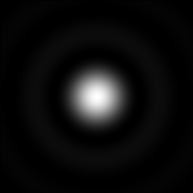
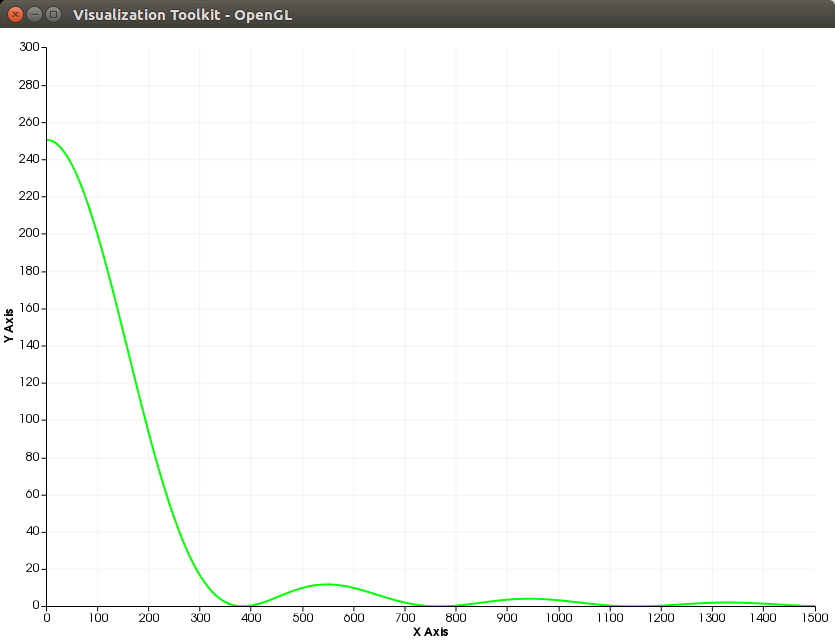

# deconvolution tools

本项目目的是通过C++实现PSF数据生成和图像的反卷积，目前已经尝试使用基于高斯模型的PSF模型。

## Dependence
- Boost >= 1.58
- OpenCV >= 3.1.0
- VTK >= 5.1

## Build & Run
```
make
./bin/psf
```

## TODO:
- [x] 使用Boost库生成贝塞尔表
- [ ] 通过OpenCV对图像进行滤波
- [x] 通过对图像进行快速傅里叶变换
- [x] 引入多线程
- [ ] 对图像进行维纳滤波
- [x] 加入vtk的可视化内容
- [x] 通过matio读取并对照mat文件
- [ ] 图像尺寸对比

## Current Result
|PSF|One Line Value|
|:---:|:---:|
|||